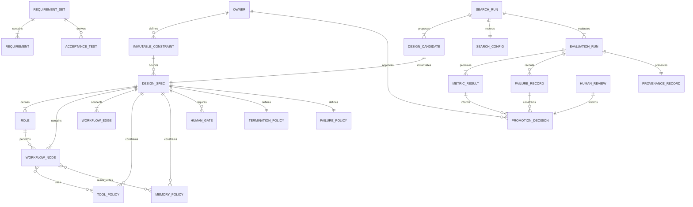

GPTSwarm 把语言 Agent 表示为 computational graph，分别优化 node prompt 与 edge connectivity；其优点是结构清楚、便于组合和可视化，缺点是复杂条件、异常处理、动态循环和权限语义不一定能被普通 graph edge 完整表达。citeturn1search0turn1search11

ADAS 的 Meta Agent Search 则把 Agent 定义为 code：meta-agent 迭代编程新 Agent、执行 validation、把发现加入 archive，再用 archive 产生下一代。Code 表示具有很高 expressiveness，理论上可表达 prompt、tool use 和 control flow；但“可表达”并不意味着“可有效搜索、可审计或可安全执行”。citeturn2view0turn0search2

AFlow 在 code-represented workflow 上引入 MCTS 和 reusable Operators。它固定若干模型参数，主要搜索 prompt、edge 和 operator composition，以 tree-structured experience、执行反馈和 early stopping 提高效率。其 operator library 是有效 inductive bias，却也意味着它并非在真正无约束的完整程序空间中搜索。citeturn0search1turn3view1turn11search2

MaAS 将设计对象改为 agentic supernet，即在多个潜在 architecture 上学习概率分布，并按 query 难度分配 Agent、LLM calls、tool calls 和 token budget。FlowReasoner 则训练一个 query-level meta-agent，先蒸馏 reasoning，再用包含性能、复杂度和效率的 execution reward 进行 reinforcement learning。这两者反映了领域从“一个 task family 一个固定 workflow”转向“每个 query 动态选择结构和资源”。citeturn6academia0turn6academia1

SwarmAgentic 使用语言形式的 population/PSO-inspired search，同时改变 Agent 的角色、职责、execution policy 和 collaboration structure。它更接近从零 team synthesis，但其实验集中在六类 open-ended 或 planning/generation 任务，且作者承认其缺乏 domain-specific priors、会继承 hallucination，并未覆盖具身环境或高风险工具权限。citeturn0academia48turn5view3turn5view4

RobustFlow 不以发现最高分 workflow 为唯一目标，而是训练 query-level generator 对同义描述产生 canonical、结构稳定的 workflow。OneFlow 则提出相反方向的结构简化：搜索适合 single-LLM multi-turn execution 的紧凑 workflow，从而质疑 homogeneous multi-Agent instance separation 是否必要。citeturn5view1turn7view2turn1academia44

建议 Meta-Agent 后续 Design IR 采用以下实体关系，而不是把整份设计仅存为自由文本或直接 Python：

`TARGET_SPECIFIC_INFERENCE`：此 IR 应使权限、privacy、human gate、failure transition 和 rollback 成为一等实体，而不是隐藏在 prompt 或任意代码中。这样搜索器可以改变允许的 workflow 部分，但无法重写 Owner authority。

## 实证比较、图表与发展时间线

下表比较主要研究。不同论文使用不同模型、dataset split 和指标，**不得把各行绝对分数直接横向排名**；表中结果只代表各论文自己的实验设置。

| Source | Year | Methodology | Sample size / evaluation scope | Key results | Limitations |
|---|---:|---|---|---|---|
| DSPy | 2023/2024 | Declarative LM modules；compiler 优化 demonstrations 与 module parameters | 两类主要 case studies，覆盖 math、multi-hop retrieval、QA 和 agent loops | 对 GPT-3.5 和 Llama2-13B 的普通 few-shot 报告显著提升 | 主要优化固定 program；不自动决定权限、完整 topology 或 operational governance citeturn9academia49turn9search7 |
| OPRO | 2023 | LLM 根据历史候选及 scores 迭代提出新自然语言解 | linear regression、TSP、GSM8K、BBH prompt optimization | GSM8K 最多约 +8%，部分 BBH 任务最多约 +50% 相对人工 prompt | 小模型作为 optimizer 效果可能很弱；主要是 prompt search citeturn8academia36turn8academia37 |
| GPTSwarm | 2024 | Computational graph；node prompt optimization 与 edge optimization | 多个 LM-agent tasks；ICML 2024 正式论文 | 证明 graph 可统一和优化多种 Agent composition | Graph 对动态控制流和 hard authority constraints 的表达有限；实验不是生产治理验证 citeturn1search11turn1search5 |
| PromptBreeder | 2024 | Population evolution；共同进化 task prompt 和 mutation prompt | arithmetic、commonsense reasoning、hate-speech classification | 超过多种人工 prompt strategies | Fitness 依赖训练集；搜索开销和 prompt overfitting 风险较高 citeturn8search0 |
| ADAS / Meta Agent Search | 2024/2025 | Meta-agent 在 code space 中迭代编程、评价和 archive 新 Agent | ARC：20 validation、60 test；其他主要 domains 多为 128 validation、800 test，GPQA 为 32/166 | DROP 79.4、MGSM 53.4；在其设置下超过人工与 prompt optimization baselines | 使用较旧 executor；不同 domain 独立搜索；自动执行不受信任代码；现实工具权限未评估 citeturn3view0turn12view0turn11search0 |
| AFlow | 2024/2025 | Code workflow、Operators、MCTS、execution feedback、early stopping | 六 benchmarks；HotpotQA/DROP 各 1,000，MATH 617；其余使用完整数据并作 1:4 split | 同设置平均 80.3；比人工方法平均高 5.7%；比复现 ADAS 高 19.5% | 固定模型与部分参数；operator priors 人工定义；搜索/验证成本较高；模型专用 workflow 常更优 citeturn3view1turn12view2turn11search2 |
| MaAS | 2025 | Query-dependent agentic supernet，性能与资源联合优化 | 六 benchmarks | 报告仅需既有系统 6%–45% inference cost，并提升 0.54%–11.82% | 目前主要为 preprint；supernet 和 routing 训练复杂，权限安全不是中心 objective citeturn6academia1 |
| FlowReasoner | 2025 | Query-level meta-agent；distillation 后以 execution reward 做 RL | 三个 engineering/competition coding benchmarks | 报告比 o1-mini 平均高 10.52% | 主要限于 code；reward 与 sandbox correctness 较易定义，迁移到开放任务未充分验证 citeturn6academia0 |
| SwarmAgentic | 2025 | Language-based PSO/population search，从零生成 roles 与 collaboration | 六类任务：TravelPlanner、Natural Plan 子任务、Creative Writing、MGSM 等 | TravelPlanner 对 ADAS 报告 +261.8% relative gain；Creative Writing 跨模型优于所测 baselines | 主要是 preprint；open-ended 评价含模型判断；缺少 security/permission objective；hallucination 可在迭代中传播 citeturn0academia48turn5view3turn5view4 |
| RobustFlow | 2025 | SFT + self-consistency preference optimization，生成 canonical workflow | 1,255 base descriptions、7,530 variants、31,889 workflows、六 domains、十次 robustness runs | 多类 perturbation 下平均 robustness 约 0.72–0.89；明显高于 AFlow/Flow/ScoreFlow | Code benchmark 平均 87.79，低于 FlowReasoner 94.71；结构一致不必然等于语义或安全正确 citeturn5view1turn7view0turn7view2 |
| OneFlow | 2026 | Dual-LLM workflow design + MCTS；single-LLM multi-turn execution | 六 public benchmarks：131–1,055 test samples；TravelPlanner 180；另有 Shopping-MMLU | single-agent execution 匹配或略超 homogeneous workflows，并多项降低 inference cost | 主要为 preprint；closed-model KV cost 部分为理论模拟；只测试一种有限 heterogeneous 配置 citeturn3view4turn12view4 |

AFlow 的同论文比较显示，自动化方法的价值不能由一个孤立 benchmark claim 判断。其复现实验中，AFlow 的六任务平均分为 80.3，CoT-SC 为 76.0，最简单 IO 为 72.8，而所复现 ADAS 为 67.2。这里的关键不是“AFlow 永远最好”，而是 MCTS、operator priors 和多次 execution evaluation 在该限定设置中优于其比较项。citeturn3view1turn4view1

OneFlow 的成本数据给出了更具产品意义的反事实：当 AFlow 或 OneFlow 搜索出的 homogeneous workflow 由单一 LLM 以 multi-turn 方式执行时，多项任务的成本下降，同时性能基本保持。AFlow workflow 在 HotpotQA 和 DROP 的论文成本分别下降约 63% 和 55%；OneFlow 在 GSM8K 下降约 38%。但 HumanEval 或 HotpotQA 中也存在几乎没有成本下降的情况，所以 KV-cache 收益不是无条件保证。citeturn3view4

