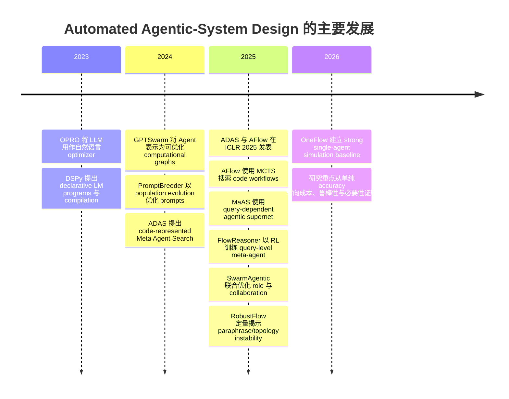

RobustFlow 的结果说明“同义需求应产生稳定设计”必须成为独立指标。AFlow 在 requirement augmentation、paraphrase 和 light noise 下的论文平均 robustness 分别只有 0.44、0.49 和 0.42；RobustFlow 对应为 0.82、0.88 和 0.89。值得注意的是，AFlow 在 heavy noise 下的分数反而上升至 0.65，作者认为这类反直觉现象说明单一结构相似度仍需结合语义正确性和 outcome 指标解释。citeturn7view0turn7view1turn7view2


主要发展时间线如下：



**成熟度判断**

| 能力 | 成熟度 | 理由 |
|---|---|---|
| 固定 pipeline 内 prompt/demo optimization | 中等 | 有多项同行评审工作和公开实现，但仍受数据与模型迁移影响 |
| 离线、benchmarkable workflow search | 初中等 | ADAS/AFlow 已发表，结果积极；成本、安全与现实任务证据不足 |
| Query-level dynamic workflow generation | 早期 | MaAS、FlowReasoner、RobustFlow 等主要为近期 preprints |
| 从零 multi-Agent team generation | 早期实验 | SwarmAgentic 等结果有潜力，但评价和 governance 证据薄弱 |
| Production runtime self-redesign | 极早期/不适合采用 | 缺乏权限、安全、事故恢复和长期漂移证据 |
| 自动方法论晋升或 target-truth rewrite | 无可接受证据 | 属治理权，不应被 benchmark objective 代替 |

## 目标函数、强基线与鲁棒性要求

自动设计的核心不是 search algorithm，而是 **objective function 和可行域**。若评价只包含 benchmark accuracy，搜索器会系统性忽略权限、成本、人类负担、可逆性和学习价值。AFlow 已使用性能—成本 Pareto 分析，MaAS 与 FlowReasoner 也把效率或复杂度纳入优化；这些工作支持多目标评价，但仍没有覆盖完整治理目标。citeturn3view1turn6academia0turn6academia1

建议 Meta-Agent 使用两阶段 objective：

```text
Feasible(W) =
    AuthorityCorrect(W)
    AND PrivacyCorrect(W)
    AND PermissionCorrect(W)
    AND NoIrreversibleWriteWithoutApproval(W)
    AND BudgetWithinHardCap(W)
    AND RequiredHumanGatesPresent(W)

只对 Feasible(W) = true 的候选比较：

F(W) = [
    TaskOutcomeQuality,
    Robustness,
    TransferRetention,
    EvidenceCompleteness,
    Reversibility,
    UserLearningValue,
    -Cost,
    -Latency,
    -FalseSuccessRate,
    -CoordinationBurden,
    -HumanReviewTime,
    -ReworkRate,
    -AdministrativeBurden
]
```

不可把上述向量永久压缩为一项固定加权分数。应保存 Pareto frontier，并由 Owner 对产品目的、acceptable risk、成本上限和 learning-value trade-off 作最终选择。否则，权重本身就会隐式取代 Owner 的价值判断。

**建议的 hard constraints、scored objectives 与 Owner-only decisions**

| 类型 | 项目 |
|---|---|
| Hard constraints | authority、privacy、credential scope、tool allowlist、不可逆写入 gate、data residency、budget ceiling、maximum retries、termination、auditability |
| Scored objectives | outcome quality、cost、latency、robustness、transfer、evidence completeness、false-success rate、review time、coordination overhead |
| Owner-only decisions | 产品目的、target truth、敏感数据用途、是否接受不可逆动作、方法论晋升、是否牺牲用户学习价值换取自动化 |

**Goodhart、reward hacking 与 judge bias**

当自动搜索直接针对 benchmark 或 LLM judge 优化时，搜索器可能学习评分器偏好，而不是任务本身。对 LLM-as-a-judge 的大规模研究已观察到 position bias，并发现 bias 的程度取决于 judge、task 和候选质量差异；因此 open-ended workflow 的单一 judge score 不可作为 promotion oracle。citeturn9academia48turn9search6

最低 evaluator protocol 应同时包含：可执行 oracle 或 unit tests、多个独立 judge、order swapping、blind human sample、held-out hidden set、adversarial examples、judge disagreement，以及重复 run。`RECOMMENDATION`：若主要改善只存在于一个 judge、一个 prompt order 或一个 validation subset，应视为 search overfitting，不得晋升。

**强制 baseline 矩阵**

| Baseline | 必须回答的反事实 |
|---|---|
| Fixed human-authored template | 搜索是否比一份稳定、低维护模板更好 |
| Direct/IO single Agent | 额外 workflow 是否真的必要 |
| Strong single Agent | 更好的 model、prompt、tools 或 long context 能否替代复杂 topology |
| Explicit deterministic workflow | 是否需要 stochastic Agent orchestration，而不是普通软件控制流 |
| Human-designed Agent/workflow | 自动化是否节省真实设计与维护工作 |
| Homogeneous multi-Agent | 多实例分工是否有价值 |
| Single-Agent simulation of the same workflow | 角色分离是否可由一个 LLM multi-turn 执行 |
| Genuinely heterogeneous design | 不同模型或工具是否提供不可模拟的能力差异 |
| Automated design method | 搜索器是否超越人工设计 |
| Random/equal-budget search | 改进是否来自算法，还是单纯更多采样和 compute |

OneFlow 使“single-Agent simulation of the same workflow”成为不可省略的 baseline；其结果显示 homogeneous multi-Agent 的多实例执行经常不是必要条件。citeturn3view4turn12view3

**最低 ablation**

任何 design-search pilot 至少需要分别移除或固定：role specialization、topology search、prompt optimization、tool routing、reviewer、memory、ensemble、model heterogeneity、search archive、execution feedback 和 evaluator。SwarmAgentic 的 ablation 表明 failure-driven adjustment、agent-level adaptation 与 collaboration reconfiguration 都对其 Creative Writing 结果有贡献，但这些结果仍需在非 judge-centric、可执行任务上复核。citeturn7view4

**鲁棒性指标**

| 指标 | 定义建议 | 最低用途 |
|---|---|---|
| Outcome paraphrase stability | 同义需求下成功率或评分的均值、方差与最坏值 | 检测表述敏感性 |
| Node consistency | 同义需求设计间功能节点匹配 F-score | 检测 role/operator 漂移 |
| Graph/topology consistency | canonical graph edge/topology similarity | 检测结构抖动 |
| Topology entropy | paraphrase cluster 内独特 topology 分布熵 | 识别不必要随机性 |
| Seed reproducibility | 多 seed 候选、性能和成本的方差 | 检查 search reliability |
| Transfer retention ratio | 新模型/domain/tool 结果 ÷ 原设置结果 | 检测 overfitting |
| Version sensitivity | model/API/tool version 更新后的退化 | 维护风险 |
| False-success rate | evaluator 通过但真实 acceptance test 失败比例 | 防止 reward hacking |
| Permission violation rate | 越权、未授权 tool 或写入的发生率 | 必须为零的 hard metric |
| Human rework rate | reviewer 要求实质修改的候选比例 | 评估真实生产力 |
| Recovery success | injected failure 后是否进入正确 fallback/rollback | 检查 resilience |
| Judge disagreement | 独立 judges 或人类之间的分歧率 | 评估评价不确定性 |

RobustFlow 的 node/graph similarity 是重要起点，但“稳定地生成同一个错误 workflow”也可能获得高 robustness。因此结构稳定必须与 outcome、permissions、failure recovery 和 evidence correctness 联合评价。citeturn7view0turn7view2

**停止条件**

| 条件 | 处置 |
|---|---|
| requirements 互相冲突 | 停止搜索并请求 Owner 决策 |
| 缺少 acceptance oracle 或可信 evaluator | 停止自动优化，只允许生成候选 |
| hard constraint violation | 立即淘汰候选，不允许用高 performance 抵消 |
| hidden-test 无改善 | 停止并报告 validation overfit |
| Pareto frontier 连续若干轮无改善 | early stop |
| search cost 超预算 | 终止并保留最佳已验证候选 |
| topology 在同义输入下高度不稳定 | 不得 promotion |
| 结果不优于 strong single Agent 或 fixed workflow | 默认选择较简单 baseline |
| evaluator disagreement 超阈值 | 转人工 review |
| 发现不可逆、权限或隐私风险 | 终止整个 search run 并审计日志 |

## 治理边界、采用阶梯与 Meta-Agent 映射

NIST AI RMF 将 AI 风险管理组织为贯穿设计、开发、部署和使用生命周期的治理活动，并强调 testing、evaluation、verification and validation；其框架不是 Agent-search 算法，但支持“搜索结果必须经过独立 TEVV 和治理审批”的架构。citeturn10search4turn10search9turn10search11

