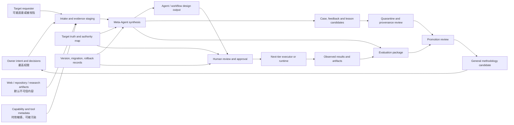

```yaml
research_id: MA-DR-07
research_title: Meta-Agent Security Threat Model and Adversarial Evaluation
target_project: Meta-Agent
report_role: external_security_research_evidence_non_execution_source
```

# Meta-Agent 专属安全威胁模型与对抗评估

## 执行摘要与证据边界

**Executive security verdict**

```yaml
overall_verdict: HIGH_BLAST_RADIUS_DESIGN_AUTHORITY_SYSTEM_REQUIRING_SECURITY_GATES_BEFORE_ANY_BOUNDED_PILOT
current_v0_1_posture: CONSERVATIVE_AND_DIRECTIONALLY_SOUND_BUT_NOT_OPERATIONALLY_VALIDATED
broad_operational_use: NOT_SUPPORTED
private_material_use: NOT_SUPPORTED
RAG_MCP_SHARED_MEMORY_AUTO_WRITEBACK: REMAIN_PROHIBITED_OR_RESEARCH_GATED
bounded_public_synthetic_pilot: CONDITIONALLY_SUPPORTABLE_AFTER_MINIMUM_SECURITY_GATE
meta_level_security_proven: false
adversarial_suite_executed: false
controls_implemented_or_tested_by_this_report: false
```

Meta-Agent 的主要风险不是一次回答错误，而是**错误的设计、权限、能力事实或方法论被包装成可复用资产，并传播到多个后续 Agent、workflow 和 target projects**。传统 application threat model 通常聚焦单次请求、数据机密性和运行时权限；Meta-Agent 还需要保护四条额外的语义转换链：

```text
untrusted evidence → trusted design premise
project-specific case → general methodology
platform capability → task authority
historical or handoff artifact → current execution source
```

当前 v0.1 的安全方向是合理的：唯一 target truth、artifact-role separation、task-local write authorization、禁止自动 methodology promotion、禁止 private Git material、single-Agent-first、human-only authority、稳定 ID/version/migration/rollback，以及默认不启用 RAG、MCP、shared memory 或 auto-writeback。这些规则显著降低了当前 inactive、file-based 基线的暴露面，但文件中存在规则不等于规则已被 runtime 强制执行或通过 red-team 验证。fileciteturn1file0L2-L2 fileciteturn3file0L2-L2 fileciteturn4file0L2-L2

外部证据表明，Meta-Agent 任务要求中列出的攻击并非纯理论问题。已发表的 Agent Security Bench、AgentDojo 和 USENIX prompt-injection benchmark 证明了 direct/indirect prompt injection、tool-use hijacking 和安全—效用冲突的普遍性；2025–2026 年的 MINJA、MemoryGraft、MemMorph、AgentLure/ARGUS、MCPTox、TMA-NM、SMSR 和 sleeper-memory 研究进一步展示了 query-only memory injection、poisoned experience retrieval、tool-selection poisoning、context-aware injection、tool-description poisoning、origin laundering 与跨会话持久化。绝大多数 2026 年工作仍是非常新的 preprint，应视为“高相关初步证据”，不能视为跨框架行业定论。citeturn2academia12turn7search8turn7search4turn5academia44turn3academia46turn6academia26turn4academia12turn6academia27turn3academia49turn5academia45turn5academia46

**核心结论**

| 决策问题 | 结论 | 声明类型 |
|---|---|---|
| 最重要资产 | Owner intent、sole target truth、authority/source map、general methodology、Design IR、permission boundaries、case/evaluation provenance、rollback state | `TARGET_SPECIFIC_INFERENCE` |
| 独特最高风险 | project evidence 被提升为通用方法；恶意 capability metadata 诱导过度授权；受污染设计跨项目传播；rollback 后被 derived artifact 或 memory 复活 | `TARGET_SPECIFIC_INFERENCE` |
| 当前 v0.1 是否安全 | 不可作此声明；只能说暴露面被有意收缩，且治理结构与现有研究方向一致 | `VERIFIED_PRIMARY_EVIDENCE` + repository evidence |
| bounded pilot 前最低要求 | immutable pilot manifest、typed read/write boundary、source-origin labels、promotion quarantine、independent verification、budget/loop limits、synthetic adversarial suite、rollback drill | `RECOMMENDATION` |
| 最应保持禁止的功能 | private material、unbounded MCP、shared cross-project memory、automatic experience promotion、autonomous writeback、self-approved remediation | `RECOMMENDATION` |
| 最大未解决问题 | 如何低成本地证明设计输出没有被不可信材料、stale capability facts 或 poisoned feedback 影响 | `UNRESOLVED` |

**Meta-Agent-specific binding and repository inputs read**

本研究通过 GitHub connector 读取了要求的七个文件；执行时 `master` 与准备时 ref `4eb4181ee7642aa6992c57802d052a4f39d0147e` 比较结果为 identical，因此本报告绑定于：

```yaml
repository: 08822407d/Mnemosyne
actual_ref: master@4eb4181ee7642aa6992c57802d052a4f39d0147e
required_inputs_read:
  - target-projects/meta-agent/current/approved-spec.md
  - target-projects/meta-agent/current/active-context.md
  - target-projects/meta-agent/authority/source-and-owner-map.md
  - target-projects/meta-agent/methodology/core-methodology.md
  - target-projects/meta-agent/history/decision-version-and-migration-log.md
  - target-projects/meta-agent/research/reviews/MA-DR-01-05-cross-report-synthesis-v0.1.md
  - target-projects/meta-agent/research/reviews/MA-DR-01-05-gap-analysis-v0.1.md
repository_modifications_made: false
```

仓库记录确认：v0.1 已被 Owner 以 `ACCEPT_WITH_LIMITATIONS` 接受为 inactive design and governance baseline；target truth 尚未对 operational use 生效；pilot、private material、advanced automation、RAG、MCP 与 auto-writeback 均未获授权。fileciteturn1file0L2-L2 fileciteturn2file0L2-L2 fileciteturn5file0L2-L2

DR-01–05 synthesis 与 gap analysis 也明确指出，现有报告不证明 automated Agent design quality、Meta-level security 或 architecture optimization；Meta-level security threat model、portable Agent Design IR 和 benchmark/adversarial protocol 仍是核心缺口。fileciteturn6file0L2-L2 fileciteturn7file0L2-L2

## 系统模型与威胁面

**System model, assets, actors and trust boundaries**

Meta-Agent 应被建模为一个**design-authority transformation system**，而不是普通聊天 Agent。其安全输出不是仅有文本，还包括可能被执行者解释为角色、workflow、权限、memory policy、evaluation gate 和 human-decision boundary 的规范。



图中的关键安全原则是：**信息可以进入 reasoning context，但不能因此自动获得 authority；结果可以成为 evidence，但不能因此自动成为 methodology；工具可以技术上可调用，但不能因此自动获得 task authorization。**

受保护资产至少包括：

| 资产组 | 具体对象 | 主要安全属性 |
|---|---|---|
| Owner 与 authority | Owner intent、decision records、approval、exception scope | authenticity、non-repudiation、scope integrity |
| Truth 与 requirements | sole target truth、requirements、non-goals、authority map | integrity、uniqueness、freshness |
| Methodology | approved methods、candidate methods、promotion records、counterexamples | provenance、generalizability、anti-poisoning |
| Case 与 evidence | target-specific cases、feedback、research evidence、source excerpts | origin、scope、sensitivity、non-laundering |
| Design outputs | roles、workflow graph、permissions、memory rules、tool routing、fallbacks | least privilege、completeness、safe defaults |
| Capability facts | model/tool/provider features、versions、limitations、permission semantics | freshness、attestation、scope |
| Runtime and handoff | current state、handoff、execution manifest、next-tier contract | freshness、non-authoritativeness unless approved |
| Evaluation | benchmark cases、judge prompts、ground truth、promotion records | independence、tamper evidence、anti-Goodhart |
| Operational resources | credentials、budget、quota、external side-effect authority | confidentiality、bounded use、revocability |
| Recovery | audit trail、versions、tombstones、rollback snapshots | reconstructability、anti-resurrection |

主要 threat actors 不能只按“外部攻击者”分类。对 Meta-Agent 更实用的划分是：

| Actor | 能力假设 | 典型目标 |
|---|---|---|
| malicious target-project requester | 可提交需求、样本或“成功经验” | 将 target-specific 或恶意偏好提升为通用设计原则 |
| compromised research/web/repository source | 可控制 Meta-Agent 将读取的文档 | indirect injection、source laundering、secret exfiltration |
| malicious connected app/tool/MCP server | 可控制 metadata、tool output 或授权流程 | tool routing hijack、confused deputy、capability inflation |
| compromised specialist Agent | 可提交分析、总结或 evaluation | laundering、false consensus、suppression of evidence |
| untrusted next-tier executor | 能看到设计并可能有工具权限 | 越权执行、虚假完成、篡改 artifact identity |
