| authorized-but-malicious collaborator | 具有合法写入或 review 权限 | provenance forgery、rollback resurrection、audit tampering |
| accidental model error | hallucination、instruction confusion、stale recall | false capability facts、missing controls、unsafe defaults |
| stale context/corrupted handoff | 不要求恶意主体 | 执行过期设计、把 handoff 当 truth |
| evaluation contributor | 可提交 benchmark、feedback、judge input | reward hacking、benchmark contamination、fake consensus |
| capability-metadata influencer | 可更新版本表、tool descriptions | 诱导权限扩大或错误 backend mapping |

**Design-time / runtime / memory / promotion / migration attack surface**

传统 STRIDE 可作为底层骨架，但 Meta-Agent 需要增加 `Promotion and Propagation` 维度：

| STRIDE+P 类别 | Meta-Agent 实例 |
|---|---|
| Spoofing | MCP server impersonation、伪造 Owner decision、伪造 evaluator identity |
| Tampering | requirements、capability matrix、case feedback、audit、memory、benchmark ground truth 被修改 |
| Repudiation | executor 声称已完成但无 artifact identity；reviewer 否认批准了权限变化 |
| Information Disclosure | target secret 被嵌入 reusable template；tool parameters/logs 泄漏 private data |
| Denial of Service | unbounded loops、context flooding、quota exhaustion、multi-Agent amplification |
| Elevation of Privilege | platform permission 被解释为 task authorization；reviewer 变 executor；cross-Agent confused deputy |
| Promotion/Propagation | poisoned case 被提升为 general methodology；错误设计被复制到多个 project；rollback 后从 summary/index 恢复 |

各阶段最重要的失效模式如下：

| 阶段 | 入口 | 特有攻击 | 最高价值控制 |
|---|---|---|---|
| intake/design-time | requirements、documents、tool descriptions | indirect injection、capability inflation、malicious requirement | origin labels、instruction/data separation、quarantine |
| synthesis-time | evidence、methods、capability matrix | over-privileged design、control omission、secret templating | typed Design IR、least privilege、independent verifier |
| execution handoff | design package、executor contract | authority delegation、false completion、stale-base execution | signed manifest、exact scope、artifact verification |
| memory write/retrieval | cases、feedback、lessons | MINJA、MemoryGraft、sleeper poison、retrieval dominance | write-time origin binding、quarantine、promotion gate |
| evaluation/promotion | judge inputs、scores、postmortems | judge injection、Goodhart、fake consensus、evidence suppression | isolated evaluator、fixed ground truth、counterevidence retention |
| migration/handoff | summaries、indexes、renames、provider mapping | role laundering、semantic drift、stale capability reuse | lineage map、semantic diff、version pinning |
| incident/rollback | revert、purge、rebuild | hidden poison survives in derived data or external copies | tombstones、rebuild from clean source、anti-resurrection scan |

**Threat taxonomy and attack trees**

```mermaid
flowchart TD
    A[Goal: compromise future Meta-Agent designs] --> B[Corrupt inputs]
    A --> C[Corrupt authority]
    A --> D[Corrupt memory or promotion]
    A --> E[Corrupt design output]
    A --> F[Corrupt evaluation and recovery]

    B --> B1[Direct malicious requirement]
    B --> B2[Indirect injection in research/repo]
    B --> B3[Malicious tool description or output]
    B --> B4[False/stale capability fact]

    C --> C1[Platform permission → task authority]
    C --> C2[Delegated authority not possessed]
    C --> C3[Evidence/handoff → target truth]
    C --> C4[Temporary exception → permanent default]

    D --> D1[MINJA query-only memory write]
    D --> D2[MemoryGraft poisoned experience]
    D --> D3[Summary/trusted-tool origin laundering]
    D --> D4[Sybil corroboration]
    D --> D5[Rollback-resistant resurrection]

    E --> E1[Over-privileged Agent spec]
    E --> E2[Missing stop/rollback]
    E --> E3[Unsafe multi-Agent shared state]
    E --> E4[Security field dropped in backend mapping]

    F --> F1[LLM-as-judge injection]
    F --> F2[Benchmark contamination]
    F --> F3[Cherry-picked evidence]
    F --> F4[False artifact/completion claim]
    F --> F5[Audit or postmortem tampering]
```



这里最危险的路径不是“攻击文本直接执行工具”，而是：

```text
malicious artifact
→ plausible summary
→ apparently successful case
→ methodology candidate
→ Owner review without visible origin
→ reusable design default
→ repeated exposure across projects
```

该路径具有高 persistence、高 blast radius、低 detectability 和可能较低 reversibility；即使原始恶意材料被删除，summary、case record、embedding、evaluation result 或 template 也可能重新引入相同语义。

## 已证实攻击与控制有效性

**Evidence table of demonstrated attacks and limitations**

| 研究 | 证明了什么 | 实验范围与指标 | 关键限制 | 证据状态 |
|---|---|---|---|---|
| Agent Security Bench / ASB | Agent 在 direct/indirect injection、memory poisoning、Plan-of-Thought backdoor 和 mixed attack 下普遍脆弱；mixed attack 平均 ASR 达 84.30% | 10 scenarios、400+ tools、13 LLM backbones、约 90,000 cases；ICLR 2025 | 多数 agent 基于特定 ReAct/tool abstractions；ASR 不能外推到 Meta-Agent | `VERIFIED_PRIMARY_EVIDENCE` citeturn2academia12 |
| AgentDojo | tool-return indirect injection 可破坏 agent security properties；安全评估必须同时测 utility | 97 realistic tasks、629 security cases；NeurIPS 2024 | 环境和工具是 benchmark abstraction，不覆盖 methodology promotion | `VERIFIED_PRIMARY_EVIDENCE` citeturn7search8 |
| Open Prompt Injection benchmark | 多种 prompt-injection attack 与 defense 可以统一形式化，单一 delimiter/prompt defense 不可靠 | 5 attacks、10 defenses、10 LLMs、7 tasks；USENIX Security 2024 | 主要针对 LLM-integrated apps，未覆盖持久 memory 和设计传播 | `VERIFIED_PRIMARY_EVIDENCE` citeturn7search4 |
| CaMeL | control/data-flow separation 与 capability policy 可提供较强系统级保证 | AgentDojo 上 v2 报告 77% task success，对比 undefended 84%；约 2.8× token overhead | 依赖可提取的程序结构和 policy；开放式 design synthesis 较难编译为固定 control flow | `FORMAL_OR_MACHINE_CHECKED_CLAIM` / preprint citeturn7search0turn7search3 |
| AgentLure / ARGUS | context-dependent task 使“所有外部内容只当 data”过度简单；需要验证行动的 benign causal support | 320 context-aware samples、8 vectors、6 surfaces；ASR 28.8%→3.8%，保留 87.5% clean utility | 2026 preprint；审计组件本身使用 LLM；仍需跨实现复现 | `VERIFIED_PRIMARY_EVIDENCE`，成熟度低 citeturn4academia12turn4search0 |
| MINJA | 攻击者无需直接写 memory，仅通过正常 query/output interaction 即可诱导恶意 record | 多类 memory-based agents；研究报告多数设置 ISR 超过 90%，部分 ASR 超过 70% | 攻击依赖系统自动写入经历；后续 EHR 研究显示有大量合法 memory 时效果可明显下降 | `VERIFIED_PRIMARY_EVIDENCE` + bounded generalization citeturn5academia44turn5academia47 |
| MemoryGraft | 少量“成功经验”可通过 semantic imitation 和 hybrid retrieval 持久影响后续任务 | MetaGPT DataInterpreter、GPT-4o；10/110 poison 导致 23/48 retrieved records 为 poison | 单框架、单主要 backbone、12 benign workloads；更像 proof-of-concept | `VERIFIED_PRIMARY_EVIDENCE`，2025 preprint citeturn3academia46 |
| Hidden in Memory | 外部文档可诱导 stateful assistant 写入 sleeper memory，并在未来会话触发 agentic action | 论文报告 poisoned-memory write 最高 99.8%；成功 retrieval 后 action steering 为 60–89% | 2026 very recent preprint；依赖具体产品 memory semantics | `VERIFIED_PRIMARY_EVIDENCE`，成熟度低 citeturn5academia46 |
| MPBench systematic study | memory aggression 与 exploitability 存在结构性张力；prompt-injection filters 未完整覆盖 memory write channels | 四种 memory-write channel、九类 structural vulnerabilities、六类 attack | 2026 preprint；跨产品实现仍有限 | `MULTI_SOURCE_PATTERN` citeturn5search11 |
| MemMorph | 三条 poisoned records 可改变 tool-selection policy，而不必污染 tool metadata | 3 benchmarks、10 backbones、3 memory modules；最高 ASR 85.9% | 2026 preprint；最高值不代表平均 deployment risk | `VERIFIED_PRIMARY_EVIDENCE`，成熟度低 citeturn6academia26 |
| MCPTox | tool description 本身即为 prompt-injection surface，甚至无需调用 malicious tool | 45 live MCP servers、353 tools、1,312 test cases、20 agent settings；最高报告 ASR 72.8% | 2025 preprint；server 和 model 版本变化快 | `VERIFIED_PRIMARY_EVIDENCE` citeturn6academia27 |
| MCP-ITP / ShareLock | 隐式 tool poisoning 可诱导调用合法高权限工具；多工具可分散恶意 payload 以逃避检查 | MCP-ITP 最高 84.2% ASR、MDR 最低 0.3%；ShareLock 平均 ASR 超过 90% | 2026 preprints；攻击需控制或更新 MCP metadata | `VERIFIED_PRIMARY_EVIDENCE`，成熟度低 citeturn6academia25turn6academia24 |
| TMA-NM | summary、trusted-tool echo、manufactured corroboration 可清洗 origin；content/lineage-only authority 可能不可靠 | machine-checked TLA+ claims；8 models；现有 defense 最高 68% laundering ASR，构造报告 0% | 单一 2026 preprint；0% 仅在其 formal model 和 benchmark assumptions 下成立 | `FORMAL_OR_MACHINE_CHECKED_CLAIM`，需独立复现 citeturn3academia49 |
