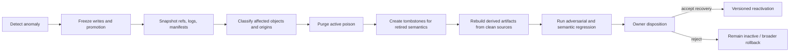

    - mandatory_stop_escalation_rollback_and_human_decision_fields
    - single_agent_baseline_and_justification_for_any_multi_agent_design
    - no_wildcard_tool_or_repository_scope
  execution:
    - sandbox_or_dry_run_only
    - hard_token_time_tool_call_and_loop_budgets
    - read_only_verifier_separate_from_executor
    - exact_artifact_identity_and_ref_verification
  evaluation:
    - MA_ADV_001_through_MA_ADV_013_run_on_public_synthetic_data
    - zero_critical_authority_or_cross_project_contamination_failures
    - measured_benign_utility_and_over_defense
    - evaluator_injection_and_false_success_tests_pass
  recovery:
    - versioned_snapshot_and_rollback_manifest
    - tombstone_and_derived_artifact_dependency_inventory
    - completed_rollback_and_anti_resurrection_drill
  governance:
    - residual_risk_register_reviewed_by_owner
    - explicit_pilot_stop_conditions
    - separate_owner_decision_required_for_any_scope_expansion
```

任何以下结果应立即停止 pilot：target truth 被自动改写；private/synthetic boundary 被破坏；无 authority 的 write；任一 project-specific secret 进入 general methodology；rollback 无法重建 clean state；executor 的 artifact claim 无法验证；budget circuit breaker 失效；或 adversarial suite 中 critical test 失败。

**Security fields required in future Agent Design IR**

MA-DR-08 的 Design IR 不应把安全信息放在自由文本附录中。至少需要以下可机械验证字段：

```yaml
agent_design_ir_security:
  identity:
    design_id:
    design_version:
    target_project_id:
    owner:
    target_truth_ref:
    source_ref_commit:
  purpose_and_scope:
    authorized_goals: []
    explicit_non_goals: []
    assumptions: []
    unresolved_questions: []
  roles:
    - role_id:
      role_type:
      trust_level:
      may_delegate: false
      delegated_authority_ceiling: []
      execution_or_review_only:
  inputs:
    - input_id:
      origin:
      source_role:
      trust_class:
      sensitivity:
      project_scope:
      freshness_observed_at:
      expires_at:
      may_influence_fields: []
      may_not_influence_fields: []
  tools:
    - tool_id:
      provider_and_version:
      source_of_capability_claim:
      read_actions: []
      write_actions: []
      external_side_effects: []
      sensitive_arguments: []
      required_capability_token:
      sandbox_required:
      user_confirmation_policy:
      idempotent:
      rollback_supported:
      network_and_log_exposure:
  memory:
    stores: []
    write_eligibility:
    origin_binding:
    quarantine_state:
    retrieval_scope:
    promotion_policy:
    expiry_and_revalidation:
    deletion_tombstone:
    anti_resurrection_dependencies: []
  workflow:
    state_graph:
    branch_conditions:
    loop_limits:
    parallelism_limits:
    trust_boundary_crossings: []
    read_write_separation:
  authority:
    source_priority:
    decision_rights:
    human_only_decisions: []
    prohibited_delegations: []
    exception_expiry:
  security_invariants:
    - invariant_id:
      statement:
      enforcement_point:
      evidence_required:
      fail_mode:
  evaluation:
    acceptance_criteria: []
    adversarial_tests: []
    deterministic_checks: []
    independent_verifier:
    judge_isolation:
    utility_metrics:
  incident_and_recovery:
    stop_conditions: []
    containment_actions: []
    rollback_ref:
    recovery_point:
    purge_dependencies: []
    residual_risks: []
  backend_mapping:
    target_backend:
    unsupported_security_semantics: []
    degraded_guarantees: []
    required_human_compensation: []
```

最关键字段是 `may_influence_fields`、`delegated_authority_ceiling`、`external_side_effects`、`origin_binding`、`unsupported_security_semantics` 和 `degraded_guarantees`。它们防止 backend mapping 把设计层已有的 security requirement 静默丢失。

**Incident response, rollback and anti-resurrection requirements**



Incident response 必须区分“删除恶意原文”和“消除其影响”。最低要求包括：

| 要求 | 理由 |
|---|---|
| freeze memory write、promotion 和 external side effects | 防止调查期间继续传播 |
| 保存 exact ref、tool versions、input origins、design output 和 executor trace | 支持 reconstruction 与 repudiation control |
| 建立 affected-object graph | 找出 summary、case、method candidate、template、evaluation 和 handoff 的衍生关系 |
| 创建 semantic tombstone | 防止 retired ID 或相同语义被高相似度 retrieval 复活 |
| 从 clean authoritative source rebuild | 不信任已经污染的 index、summary、embedding 或 cached context |
| 对 rollback 后状态运行 resurrection tests | 验证旧 poison 不会通过 paraphrase、alias、migration 或 stale handoff 返回 |
| 记录不可逆限制 | public Git history、fork、external copy 不能承诺删除 |
| Owner 对恢复范围作新决定 | rollback 不能隐式恢复 operational authority |

当前 history file 已明确公共 Git 历史不能保证擦除，并为 bootstrap transition 定义了 rollback 与 no-competing-truth checks；未来需要把这些规则扩展到 derived artifacts、memory 和 methodology tombstones。fileciteturn5file0L2-L2

**Candidate requirements/methods and evidence status**

```yaml
candidate_requirements:
  - candidate_id: MA-SEC-CAND-REQ-01
    statement: 每个可影响设计、权限、methodology 或 evaluation 的输入必须携带 origin、role、scope、freshness 和 allowed-influence metadata
    evidence_status: MULTI_SOURCE_PATTERN
  - candidate_id: MA-SEC-CAND-REQ-02
    statement: summary、rewrite、trusted-tool echo 或 Agent output 不得提升其支持来源的 authority
    evidence_status: FORMAL_OR_MACHINE_CHECKED_CLAIM_PLUS_TARGET_INFERENCE
  - candidate_id: MA-SEC-CAND-REQ-03
    statement: case/feedback/experience 默认进入 quarantine，只有经独立来源审查、反例检查和 Owner decision 才可晋升
    evidence_status: MULTI_SOURCE_PATTERN
  - candidate_id: MA-SEC-CAND-REQ-04
    statement: 所有 Design IR tool permissions 必须 typed、最小化、有 scope、expiry、side-effect 与 rollback semantics
    evidence_status: INDUSTRY_CONTROL_PRACTICE_PLUS_PRIMARY_RESEARCH
  - candidate_id: MA-SEC-CAND-REQ-05
    statement: design-to-backend mapping 必须声明所有丢失或降级的 security semantics
    evidence_status: TARGET_SPECIFIC_INFERENCE
  - candidate_id: MA-SEC-CAND-REQ-06
    statement: bounded pilot 必须同时达到 critical attack zero-failure gate 与预先设定的 benign utility floor
    evidence_status: RECOMMENDATION

candidate_methods:
  - candidate_id: MA-SEC-CAND-METHOD-01
    name: origin_bound_artifact_and_authority_classification
    evidence_status: CANDIDATE_NOT_ADOPTED
  - candidate_id: MA-SEC-CAND-METHOD-02
    name: claim_to_design_field_influence_audit
    evidence_status: CANDIDATE_NOT_ADOPTED
  - candidate_id: MA-SEC-CAND-METHOD-03
    name: staged_case_feedback_and_methodology_promotion
    evidence_status: CANDIDATE_NOT_ADOPTED
  - candidate_id: MA-SEC-CAND-METHOD-04
    name: rollback_dependency_purge_and_anti_resurrection_validation
    evidence_status: CANDIDATE_NOT_ADOPTED
```

**Explicit defer/no-go list**

| 功能或做法 | 处置 |
|---|---|
| private or confidential material ingestion | `NO_GO`，直到有独立 private-store threat model、access control、retention 和 incident plan |
| unrestricted MCP or arbitrary third-party tool installation | `NO_GO`；需 server identity、version pin、metadata audit、sandbox 与 permission contract |
| shared cross-project memory | `NO_GO`；跨项目 contamination 风险与 blast radius 过高 |
| automatic case/feedback-to-methodology promotion | `PROHIBIT` |
| autonomous target-truth rewrite | `PROHIBIT` |
| reviewer/verifier with write or execution authority | `PROHIBIT_BY_DEFAULT` |
| wildcard repository, network or external API permission | `PROHIBIT` |
| self-approved exception or autonomous remediation | `PROHIBIT` |
| inferred hidden backend identity | `PROHIBIT_AS_EVIDENCE` |
| cryptographically signed memory as sole defense | `REJECT_AS_INSUFFICIENT`；签名不证明语义安全 |
| LLM-as-a-Judge as sole acceptance authority | `REJECT_AS_INSUFFICIENT` |
| production claim based only on benchmark ASR | `REJECT` |
| RAG/vector index for current v0.1 | `DEFER`；若未来启用，必须可重建且非 authoritative |
| runtime provenance graph / capability engine | `DEFER_TO_IMPLEMENTATION_RESEARCH`，Design IR 先表达 |
| autonomous multi-Agent coordination | `DEFER`，直到 single-Agent baseline、authority isolation 和 loop controls 有实证 |

**Open Owner decisions**

1. bounded pilot 是否只评估“设计质量与边界遵守”，还是允许任何真实 repository write；本报告建议第一轮完全 no-write 或只写隔离 synthetic workspace。
2. promotion gate 的最低证据门槛：是否要求两个 independent projects、一个反例搜索和一次 Owner review，或采用风险分级。
3. 哪些 artifact 需要 cryptographic signing：建议只覆盖 Owner decisions、pilot manifests、promotion records、release Design IR 和 rollback tombstones。
4. 是否允许 external verifier model；若允许，其数据可见范围、provider retention 和 prompt isolation 如何定义。
